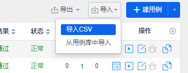

# 禅道调研报告

## 1 禅道简介

禅道由青岛易软天创网络科技有限公司开发，国产开源项目管理软件。它集产品管理、项目管理、质量管理、文档管理、组织管理和事务管理于一体，是一款专业的研发项目管理软件，完整覆盖了研发项目管理的核心流程。禅道管理思想注重实效，功能完备丰富，操作简洁高效，界面美观大方，搜索功能强大，统计报表丰富多样，软件架构合理，扩展灵活，有完善的API可以调用。禅道，专注研发项目管理！


所需核心功能：

**质量管理：包括bug、测试用例、测试任务、测试结果等功能**

##  2 部署禅道安装环境

#### **一、禅道安装部署的环境要求**

1. 禅道安装部署环境 推荐使用 Linux + Apache + PHP7.0以上版本+ MySQL5.5以上版本/MariaDB的组合。Nginx其次，不推荐IIS + PHP组合。

2. 禅道需要使用PHP的这些扩展：pdo、pdo_mysql、json、filte、openssl、mbstring、zlib、curl、gd、iconv，企业版旗舰版还需要安装： zip、xml、ldap、bcmath扩展， 请大家确保PHP环境安装加载以上扩展模块。

3. Linux系统下不推荐自己编译安装PHP，最好使用操作系统自带的包管理器安装PHP的运行环境。 

#### 二、如何搭建禅道安装部署环境

**1.** **安装Apache服务**

输入命令：

```bsh
sudo apt-get install apache2
```

安装完重启服务

```js
sudo service apache2 restart
```

服务管理：

```bsh
#启动
sudo service apache2 start
#停止
sudo service apache2 stop
```

测试是否安装成功：

在浏览器里输入http://localhost或者是http://127.0.0.1，如果看到了It works!，那就说明Apache就成功的安装了。

Apache的默认安装，会在/var下建立一个名为www的目录，这个就是Web目录了，所有要能过浏览器访问的Web文件都要放到这个目录里。

**2.** **安装PHP环境（以php7.0为** **例**）

输入命令：


```js
sudo apt-get install php7.0
```

安装完成后输入：php -v 查看PHP是否安装成功。 有的PHP扩展已默认安装，有的需要自己单独安装。
在实际安装禅道的系统检查里，如果是没有安装上的，检查后，直接再安装即可。

安装让Apache能够识别解析PHP的文件：

```bsh
sudo apt-get install libapache2-mod-php7.0
```

测试是否能解析成功：

输入命令， 切换到Apache项目目录下: 

```bsh
cd /var/www/html 
```

新建文件：

```bsh
sudo vim info.php
```

文件内容：

```php
<?php 
phpinfo(); 
?>
```

保存后浏览器访问：http://localhost/info.php

如果一切正常的话，就会看到PHP的一些信息。

**3.** **安装MySQL服务**

输入命令：

```bsh
sudo apt-get install mysql-server
```

按提示设置数据库root用户的密码。

 **5.0版本以上，root密码随机，需要通过查看随机密码进入，再进行修改原来的密码**

（1）通过其他用户登录MySQL
         执行 `cat /etc/mysql/debian.cnf`

（2）通过账号密码进行登录
        `mysql -u debian-sys-maint -p`

（3）选择数据库，`use mysql;`
         并且查询数据库的用户表格
         其root默认的方式位auth_socket

（4）修改其密码格式
		`update user set plugin='mysql_native_password' where user='root';`，查询其用户`select user,plugin from user;`

（5）执行完这一步，不要忘记刷新权限（可以理解为高并发，可能还没处理完数据让他缓存，就执行下一步操作可能会出错）
		  所以先刷新下权限：`flush privileges;`

退出登录之后要重新启动一下mysql的服务，`service mysql restart`或者是`sudo /etc/init.d/mysql restart`

重新登录服务器即可有root的密码了

如果安装过程中提示依赖不足：

```bsh
sudo apt-get install -f
```

服务管理：

```bsh
#启动
sudo service mysql start
#停止
sudo service mysql stop
#服务状态
sudo service mysql status
#连接数据库
mysql -h 127.0.0.1 -P 3306 -uroot -p123456
#-h为远程IP，-P为端口号，-u为用户名，-p为密码
#测试SQL
show databases;
```

#### 三、添加禅道的站点配置文件

安装部署的环境配置完成后，可以到Apache的站点配置中加上禅道站点的访问配置文件。
以下是示例，具体请以自己实际环境目录为准。

```js
cd /etc/apache2/sites-enabled/
sudo vim zentao.conf
在配置文件中，写入禅道站点的访问配置信息，可参考以下截图。保存退出后，请重启Apache服务。  sudo service apache2 restart
```


如果你是自己本地试用禅道，那么在Winows的hosts文件中也加上禅道站点信息。
示例：

C:\Windows\s y s t e m32\drivers\etc

hosts文件里加上：

```js
127.0.0.1 www.zentaopms.com
```

如果你是部署到服务器上，确保禅道的站点域名有解析，且其他同事可以访问到禅道服务器。
根据禅道的安装手册，安装并成功登录后，就可以使用禅道了。


## 3 安装禅道

#### **一、安装**

**禅道软件下载地址： http://www.zentao.net/download.html** 

**1、将安装包直接解压到/opt目录下**

**特别说明：** 不要 解压到别的目录再拷贝到/opt/，因为这样会导致文件的所有者和读写权限改变， 也不要解压后把整个目录777权限 。

可以使用命令： sudo tar -zxvf ZenTaoPMS.7.3.stable.zbox_32.tar.gz -C /opt

**2、** **Apache和Mysql常用命令**

执行/opt/zbox/zbox start 命令开启Apache和Mysql。

执行/opt/zbox/zbox stop 命令停止Apache和Mysql。

执行/opt/zbox/zbox restart 命令重启Apache和Mysql。

注：如果需要开机自动启动，可以把 /opt/zbox/zbox restart 加到操作系统的自启目录。

**3、访问和登录禅道**

启动 Apache和Mysql服务后，

浏览器直接访问 **http://禅道服务器ip:apache端口** 即可访问和登录禅道。

注：如果网页无法访问，请先关闭禅道所在电脑的防火墙和selinux再刷新网页访问试一下。（使用云服务器请注意在安全组中开放apache使用端口）

禅道默认管理员帐号是 admin，密码 123456。

**登录后，即可使用禅道项目管理功能。**具体的使用


**4、其他**

可以使用/opt/zbox/zbox -h命令来获取关于zbox命令的帮助。

其中 -ap参数 可以修改Apache的端口，-mp参数 可以修改Mysql的端口。

例如（apache端口改为8080，mysql端口改为3307）：

/opt/zbox/zbox stop

/opt/zbox/zbox -ap 8080 -mp 3307

/opt/zbox/zbox start

## 4 测试 ##

### 4.1 撰写用例 ###

#### 4.1.1 建用例

点击“建用例”，可以单个或批量创建用例。


在“建用例”页面，选择相应的产品、需求模块、用例类型、适用阶段、相关研发需求等。


也可以点击“批量创建”-“多项录入”。


#### 4.1.2 导入用例

**通过模板方式**

禅道中，还可以通过文件或用例库批量导入用例。


使用“导入CSV”功能，需要先使用“导出”-“导出模板”功能。在导出的模板内，填充用例数据，再将用例批量导入禅道中。


可以设置导出的记录数和格式。


点击“保存”后，会得到一个“Template.csv”的文件。


在模板中，填入用例的标题、步骤等。


使用“导入”功能导入。



可以看见禅道自动导入用例的详细信息。


**自己导入，加入附件**


#### 4.1.3 导出用例

可以导出用例的选中记录或全部记录。


可以自定义模板导出的字段，将模板命名并保存，以供下次使用。


#### **4.1.4 导入用例库**

常用的用例可以导入用例库，方便用户积累用例资产，进行复用和管理。


### 4.2 提交BUG ###

#### 4.2.1 提交Bug 

以禅道中的“测试”为例。在测试模块下，点击“提Bug”，可以单个或批量提Bug.


"批量提Bug"可以通过“多项录入”功能进行批量录入。


每一行作为Bug的标题。导入后，需对其他必填项进行手动设置。


#### 4.2.2 导出Bug

通过“导出”功能还可以将Bug列表内的数据导出。点击“导出”-“导出数据”。


可以导出全部Bug记录，或者在Bug列表中选中想要导出的Bug进行导出。点击“设置”。可以设置导出的模板，选择要导出的字段并保存为模板，可供下次快速导出使用。


#### 4.3.3 查看报表 

点击“Bug”-“报表”可以统计分析查看Bug。


在报表页面左侧，选择报表类型，点击“生成报表”，即可查看Bug的报表分析。默认以饼状图显示，也可以根据报表内容选择柱状图或者折线图展示。

